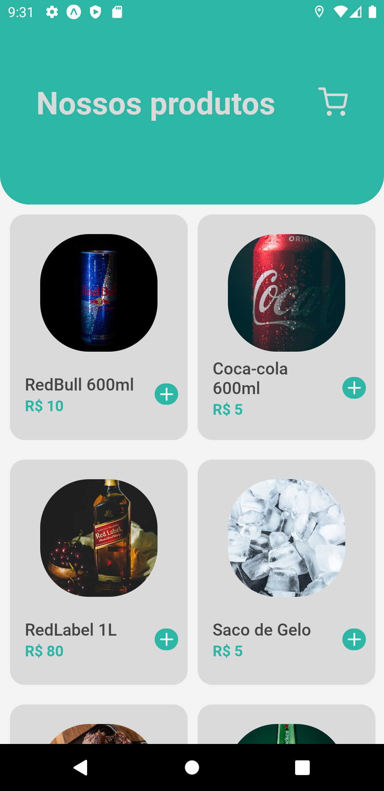
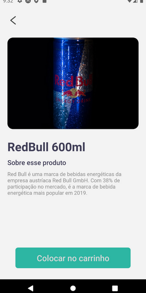
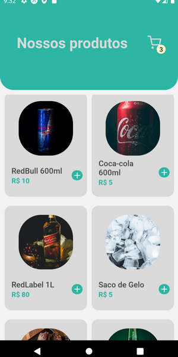
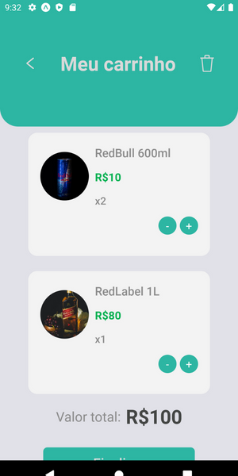

<h1 align="center"> 🔵 { Shopping cart } 🔵 </h1>

Aplicativo mobile para empresas que utilizam carrinho de compras.

 <a href="#recursos">Recursos</a> •
  <a href="#objetivo">Objetivo</a> •
 <a href="#tecnologias">Tecnologias</a> • 
 <a href="#status">Status</a> • 
 <a href=#imagens"> Imagens </a> • 

### Status

<h4 align="center"> 
	🚧 Aguardando atualizações 👨🏻‍🔧 🚧
</h4>

### Pré-requisitos

Para rodar na máquina, os requisitos são básicos: 
- [x] Configurações do React Native
- [x] Configurações do expo
- [x] Configurações do node
Como também um excelente editor de códigos:  [VSCode](https://code.visualstudio.com/)

### Recursos

- [x] Dashboard com os produtos a serem vendidos;
- [x] Script's de adicionar/remover items no carrinhos de forma simples ;
- [x] Interações Front-End;
- [x] Animações;
- [x] Tela com a visualização de produtos;

### 🛠 Tecnologias

### Objetivo

Aplicativo desenvolvido com a finalidade de empresas conseguirem suas metas através de vendas!

### Link vídeo:

### Telas:

<h3 align="center"> Produtos </h3>

 

 A página de Produtos do projeto! Inicia com os produtos de sua empresa disponível para comercialização 

 Ao clicar no produto, é possível ver a visualização de suas informaçẽos e adicionar no carrinho também. 

 

 Na tela principal, também é possível adicionar no carrinho 

<h3 align="center"> Carrinho </h3>

 

 Entrando no carrinho, você pode adicionar ou remover produtos e também finalizar a sua compra. 

<h3 align="center"> Finalizando </h3>

 

 Após clicar, seu pedido é finalizado! 

